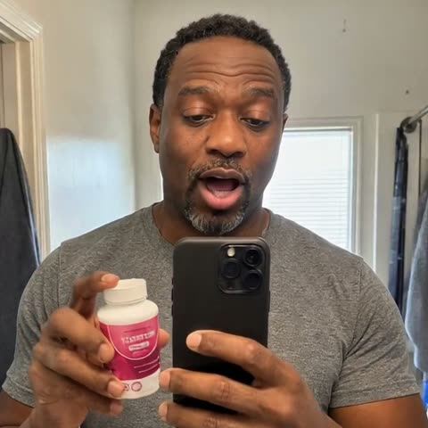

# Gradium Skills

Agent Skills for building voice products with [Gradium](https://gradium.ai):
text-to-speech, speech-to-text, live translation, voice cloning, talking
video, and live avatars. They work with Claude Code, Codex, OpenClaw, and any
agent that reads the `SKILL.md` format.

Skills are grouped by the tool they drive:

```text
gradium/     Gradium voice API: TTS, STT, translation, cloning, SDK, docs, migration
pruna/       Gradium voices driving Pruna AI talking-video models
live-avatar/ Gradium voice agents with a live avatar face, one folder per face provider:
  lemonslice/  LemonSlice face animated from a still image (LiveKit Agents)
  tavus/       Tavus Phoenix face, photoreal and video-trained (LiveKit Agents), with a live pipeline panel
  heygen/      HeyGen LiveAvatar face in LITE mode (own orchestrator, no LiveKit project needed)
```

Each skill is a self-contained folder with a `SKILL.md` and, where useful,
`references/` for deeper detail and `scripts/` that run standalone. Endpoints,
field names, and behavior notes were checked against the live APIs.

## Skills

### `gradium/` — the voice API

| Skill | What it does |
| --- | --- |
| `gradium-text-to-speech` | Text in, speech out. REST for files, WebSocket for streaming LLM output. Speed, pauses, pronunciation fixes, word timestamps, telephony formats. Ships `tts.py` and the flagship voice catalog. |
| `gradium-speech-to-text` | Audio in, text out. Batch and realtime, semantic turn-taking for voice agents, keyword boosting so product names come out right, SRT subtitles. Ships `transcribe.py`. |
| `gradium-speech-translation` | Speech in one language, speech out in another. Dubbing, live interpretation, and re-voicing a recording. Ships `s2s.py`. |
| `gradium-voice-cloning` | Clone a voice from about ten seconds of audio and manage the voice library. Includes consent guidance. |
| `gradium-sdk` | The Python SDK (`pip install gradium`): async client, call shapes, result objects, CLI. |
| `gradium-api` | Wire-level REST and WebSocket reference for any language or edge runtime, plus error shapes. |
| `gradium-docs` | Maps a task to the exact page on docs.gradium.ai so an agent fetches one page instead of crawling. |
| `gradium-setup-api-key` | Check, obtain, and validate an API key without ever pasting it into chat. Browser token pattern. |
| `migrate-to-gradium` | Move an ElevenLabs, Cartesia, or Deepgram integration to Gradium with minimal adapter changes. |

### `pruna/` — talking video

| Skill | What it does |
| --- | --- |
| `gradium-pruna-video` | Pipe a Gradium voice (flagship or cloned) into Pruna's `p-video-avatar` and `p-video` models to make a portrait or scene talk. Ships `voice_video.py` for the full pipeline and `grade_render.py` for frame-by-frame quality checks. |
| `gradium-pruna-designed-avatar` | Design a brand-new Gradium voice to match a portrait, audition and approve it, then render a reviewed talking-avatar clip or a small avatar-video product with Pruna `p-video-avatar`. Non-realtime; includes quality and safety checks. |

### `live-avatar/` — live avatars

| Skill | What it does |
| --- | --- |
| `gradium-live-avatar-agent` | `live-avatar/lemonslice/`. Scaffold a realtime voice agent from an image, a voice description, and a role. Gradium handles voice design, STT, and TTS; LiveKit orchestrates the call; LemonSlice animates the face. Includes security and privacy requirements for hosted deployments. |
| `gradium-tavus-live-avatar` | `live-avatar/tavus/`. The same stack with a Tavus Phoenix face through Tavus's echo-mode LiveKit PAL: the most photoreal, video-trained custom faces and 24 kHz audio passthrough. Documents face and PAL provisioning, Tavus billing, and an explicit end-conversation teardown. Every generated project includes a live pipeline panel beside the avatar: one sentence per stage (you, Gradium hears you, the LLM thinks, Gradium speaks, Tavus shows the face) and the time from your pause to the avatar's first word. |
| `gradium-heygen-live-avatar` | `live-avatar/heygen/`. Gradium's take on HeyGen's [LiveAvatar × GPT-Live demo](https://github.com/heygen-com/liveavatar-gpt-live-demos): Gradium streaming STT with semantic turn-taking and streaming TTS, any OpenAI-compatible LLM, and a HeyGen LiveAvatar in LITE mode as the face, with tool calls rendered as on-screen cards. Ships a runnable `orchestrator.py` plus an avatar-first web client; needs no LiveKit project of your own. |

The LemonSlice and Tavus skills share one shape: the LiveKit worker, Gradium
STT and TTS, a server-side token endpoint, and an avatar-first call page. Only
the face layer changes. The Tavus skill was exercised end to end (build from
the skill alone, then a live call) before publication.

### Skills built by partners

These live in other repositories and are maintained by their authors.

| Skill | Built by | What it does |
| --- | --- | --- |
| [`design-voice`](https://github.com/pipecat-ai/pipecat-examples/tree/main/gradium-voice-designer) | The [Pipecat](https://pipecat.ai) team | Design a custom Gradium voice from a character image (or a few questions), audition three takes, keep the winner as a permanent `voice_id`, then generate a Pipecat agent (Gradium STT and TTS with OpenAI, Gemini, or Anthropic as the LLM) and a web client from the Pipecat UI registry. In `pipecat-examples/gradium-voice-designer/`. |

## Requirements

| Folder | Environment variables | Also needs |
| --- | --- | --- |
| `gradium/` | `GRADIUM_API_KEY` | Python 3.10+, `requests`, `websockets`; `ffmpeg` recommended |
| `pruna/` | `GRADIUM_API_KEY`, `PRUNA_API_KEY` | `ffprobe` for media validation; `ffmpeg` for grading renders |
| `live-avatar/lemonslice/` | `GRADIUM_API_KEY`, `LEMONSLICE_API_KEY`, `LIVEKIT_URL`, `LIVEKIT_API_KEY`, `LIVEKIT_API_SECRET` | A LiveKit project; an LLM via LiveKit Inference or an OpenAI-compatible endpoint |
| `live-avatar/tavus/` | `GRADIUM_API_KEY`, `TAVUS_API_KEY`, `LIVEKIT_URL`, `LIVEKIT_API_KEY`, `LIVEKIT_API_SECRET` | Same as above; a LiveKit Cloud (or public) server, since Tavus's avatar joins from its hosted service |
| `live-avatar/heygen/` | `GRADIUM_API_KEY`, `LIVEAVATAR_API_KEY`, `LLM_MODEL` (+ `LLM_BASE_URL`, `LLM_API_KEY`) | Python 3.10+, `requests`, `websockets`; any OpenAI-compatible LLM endpoint |

Pruna renders, LemonSlice sessions, Tavus conversations, and LiveAvatar
sessions consume paid credits on those platforms (LiveAvatar sandbox sessions
are free; Tavus includes 25 free minutes). Each live avatar skill's
`references/avatar-provisioning.md` (Tavus) or provider docs say where credits
are bought.
Keep every key server-side. The `gradium-setup-api-key` skill covers safe
handling.

For the tested standalone-script environment, install `pip install -r requirements.txt`
in a virtual environment. Each skill remains independently copyable; its script
dependencies are documented locally. Keep private media in an ignored `outputs/`
directory and use `--out` to select the destination.

## Install

Copy a skill folder into your agent's skills directory. The folder name is the
skill name.

```bash
# Claude Code
mkdir -p ~/.claude/skills
cp -R gradium/gradium-text-to-speech ~/.claude/skills/
cp -R live-avatar/tavus/gradium-tavus-live-avatar ~/.claude/skills/

# Codex
mkdir -p ~/.codex/skills
cp -R gradium/gradium-text-to-speech ~/.codex/skills/
```

Then ask for what you want in plain language:

```text
Generate a voiceover for this script with a British male voice, slightly slower.
Transcribe call.wav and make sure it spells "Gradium" correctly.
Dub intro.mp4 into French using the speaker's own cloned voice.
```

The `agents/openai.yaml` files are Codex UI metadata. Other agents can ignore
them.

## Examples

One prompt per skill and what comes back.

| Skill | Try asking | You get |
| --- | --- | --- |
| `gradium-text-to-speech` | "Narrate docs/intro.md with a warm Irish voice, slightly slower, as an Opus file." | `intro.ogg` plus word timestamps if you want captions |
| `gradium-speech-to-text` | "Transcribe call.wav and make sure it spells Gradium and Mbappé right." | A transcript with those names boosted, optionally an SRT |
| `gradium-speech-translation` | "Dub intro.mp4 into French in the speaker's own voice." | A French audio track in a cloned voice, plus the translated script |
| `gradium-voice-cloning` | "Clone my voice from sample.wav and use it for the narration." | A permanent `voice_id` after a consent check, wired into TTS |
| `gradium-sdk` | "Write a FastAPI endpoint that streams Gradium TTS for LLM output." | Async SDK code using the realtime call shape |
| `gradium-api` | "Call Gradium TTS from a Cloudflare Worker in TypeScript, no SDK." | Raw `fetch` and WebSocket code with the exact message grammar |
| `gradium-docs` | "Which Gradium page covers Twilio audio formats?" | The one docs URL, fetched as markdown |
| `gradium-setup-api-key` | "My Gradium calls return 401." | A key check, the fix, and a credits readout as proof |
| `migrate-to-gradium` | "Switch our ElevenLabs TTS adapter to Gradium." | The smallest provider-layer diff and a smoke test |
| `gradium-pruna-video` | "Make portrait.png say this script in my cloned voice." | A lip-synced MP4 and two frame montages for grading |
| `gradium-pruna-designed-avatar` | "Design a voice to fit this portrait and render the script." | An auditioned voice, one reviewed render (see below) |
| `gradium-live-avatar-agent` | "Build a live avatar language tutor from this image." | A LiveKit worker, token server, and avatar-only web client |
| `gradium-heygen-live-avatar` | "Recreate HeyGen's LiveAvatar demo with a Gradium voice and put key terms on screen." | A Python orchestrator, a browser call surface with cards, and a sandbox session to try first |
| `gradium-tavus-live-avatar` | "Let me talk to Celine, the Tavus stock face, with a Gradium voice." | A LiveKit worker on Tavus's stock LiveKit PAL, a token server, and a call page with the live pipeline panel |

### Designed-avatar renders

Three clips made with `gradium-pruna-designed-avatar`. Click a poster to play.
Details in [examples/pruna-designed-avatar/](examples/pruna-designed-avatar/).

| Maya, support agent (25 s) | Arthur, insurance guide (35 s) | Fictional creator demo (24 s) |
| --- | --- | --- |
| [](examples/pruna-designed-avatar/support-agent-maya.mp4) | [](examples/pruna-designed-avatar/insurance-guide-arthur.mp4) | [](examples/pruna-designed-avatar/supplement-testimonial.mp4) |

Every portrait and voice is AI-generated; no real person is depicted. These are
fictional scripted performances, not real customer experiences or product claims.
The creator clip and poster carry that disclosure within the assets themselves.

## Run the scripts without an agent

```bash
export GRADIUM_API_KEY=...
python gradium/gradium-text-to-speech/scripts/tts.py "Hello, world!" --out hello.wav
python gradium/gradium-speech-to-text/scripts/transcribe.py hello.wav --language en
python gradium/gradium-speech-translation/scripts/s2s.py hello.wav --to fr \
    --voice YhIHaAfQ0cQPDV9R --out bonjour.wav
```

`examples/generate.sh` runs every audio script against the live API and doubles
as a smoke test. See [examples/README.md](examples/README.md).

The HeyGen live avatar is a server, not a one-shot script:

```bash
cd live-avatar/heygen/gradium-heygen-live-avatar/scripts
cp .env.example .env            # GRADIUM_API_KEY, LIVEAVATAR_API_KEY, LLM_MODEL, ...
python orchestrator.py --check  # validates the configuration
python orchestrator.py          # open http://127.0.0.1:8787 and press Start
```

Set `LIVEAVATAR_SANDBOX=1` for a free one-minute session while wiring things up.

## Contributing

Run the validator and offline regression tests before opening a pull request.
The validator checks skill packaging and common secret patterns; it is not a
complete secret scanner. CI also runs Gitleaks on history and the working tree,
and pip-audit on the resolved standalone-script dependencies.

```bash
python scripts/validate_repo.py
python -m unittest discover -s tests
```

Refresh dependencies with `uv pip compile requirements.in --python-version 3.10 -o requirements.txt`,
then run the tests and `pip-audit -r requirements.txt`. LiveKit and other packages
used by generated applications need their own resolved lockfiles and audits.

New skills go under the folder of the tool they primarily drive. Keep one
canonical copy of each skill; do not add per-agent duplicates.

## Security

Report vulnerabilities privately as described in [SECURITY.md](SECURITY.md).
Never commit a real `.env` or API key. Clone or imitate a voice only with the
speaker's consent.

## Support and license

- Docs: [docs.gradium.ai](https://docs.gradium.ai), with an agent-friendly index
  at [docs.gradium.ai/llms.txt](https://docs.gradium.ai/llms.txt)
- Contact: support@gradium.ai
- License: [MIT](LICENSE)

Pruna AI, LemonSlice, HeyGen, LiveAvatar, Tavus, LiveKit, Pipecat, ElevenLabs,
Cartesia, and Deepgram are trademarks of their respective owners. This repository is maintained by Gradium
and is not affiliated with or endorsed by those companies.
